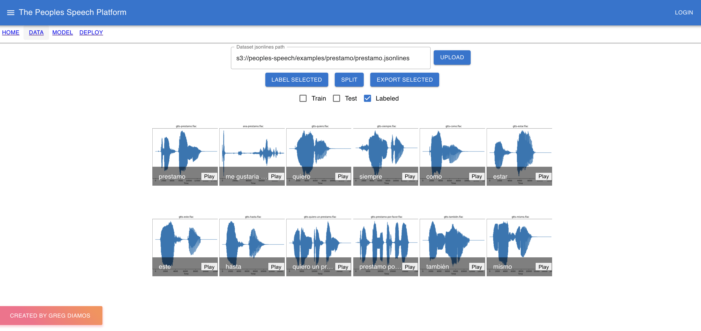

# The People's Speech

The people's speech is an enterprise MLOps platform that offers end-to-end workflow to build, iterate and operationalize AI powered speech solutions. With data quality being a key to the success of production AI systems, the people's speech is equipped with a host of specially designed data preparation tools and workflows that help users achieve optimal data accuracy and consistency. 

# Developer instructions

1. Checkout the code.

```shell
  git clone git@github.com:greg1232/peoples-speech.git
```

2. Build the server docker container.

```shell
cd peoples-speech
./scripts/build.sh
```

3. Start the development server locally.

```shell
./scripts/peoples-speech-up
```

# Preview



# Deployments

The master branch of this repo deploys automatically to a staging service at www.peoples-speech.com:3000 using [an AWS CodePipeline](https://docs.aws.amazon.com/codepipeline/latest/userguide/welcome.html)

The CodePipeline performs the following steps:
  * Checks out from the main branch of this repo
  * Builds the docker containers using [an AWS CodeBuild step](scripts/cloudbuild/buildspec.yaml)
  * Deploys to AWS EC2 using [an AWS CodeDeploy step](https://github.com/greg1232/codedeploy-peoples-speech)
